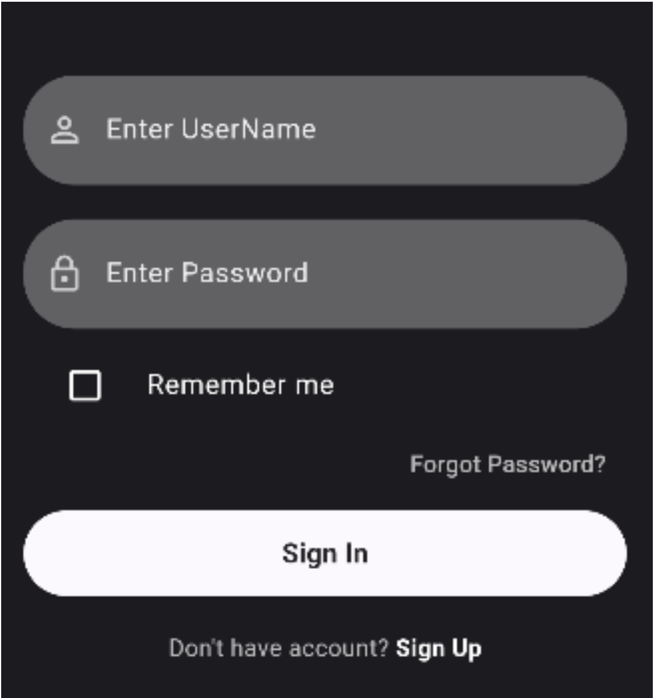
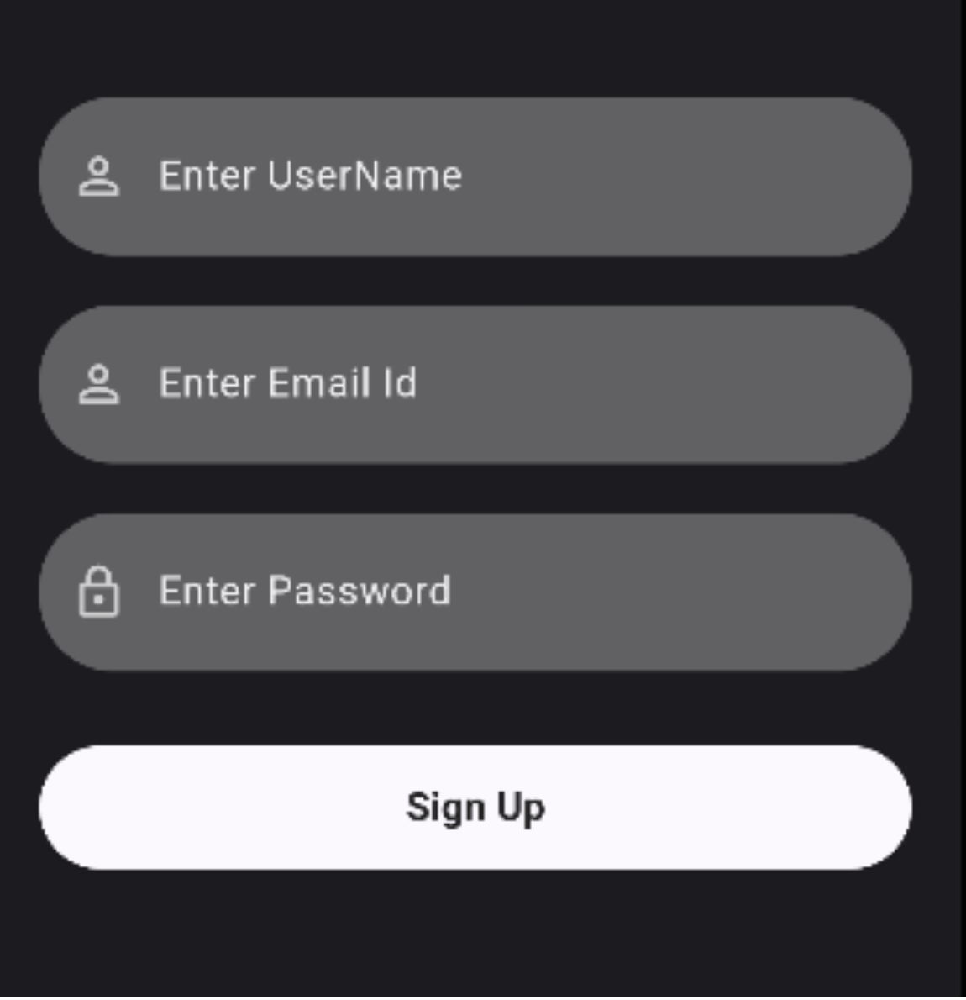
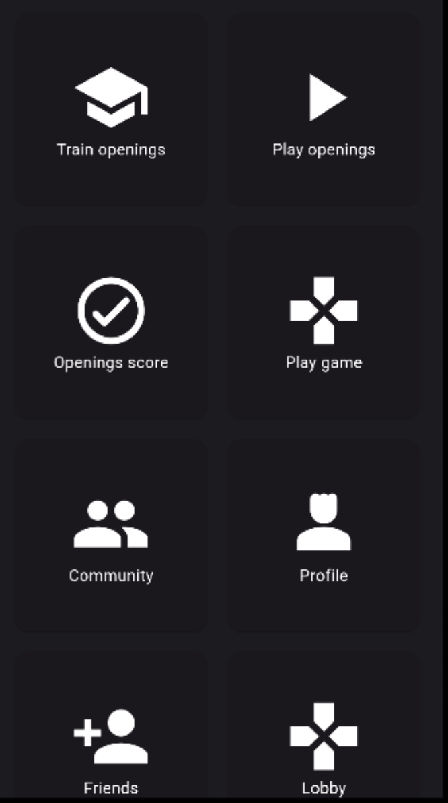
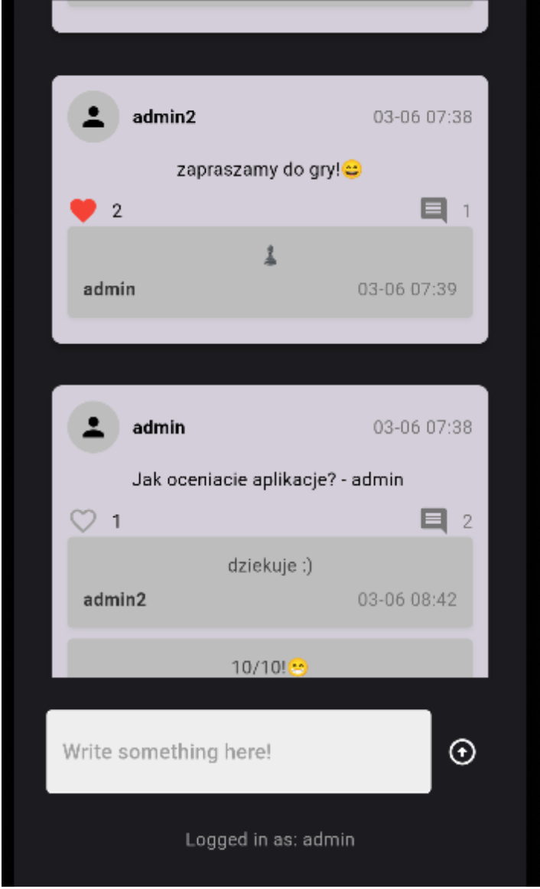
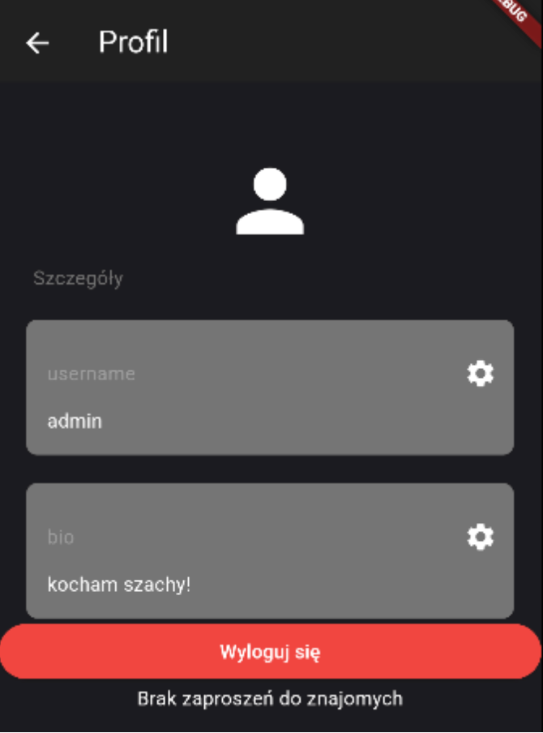
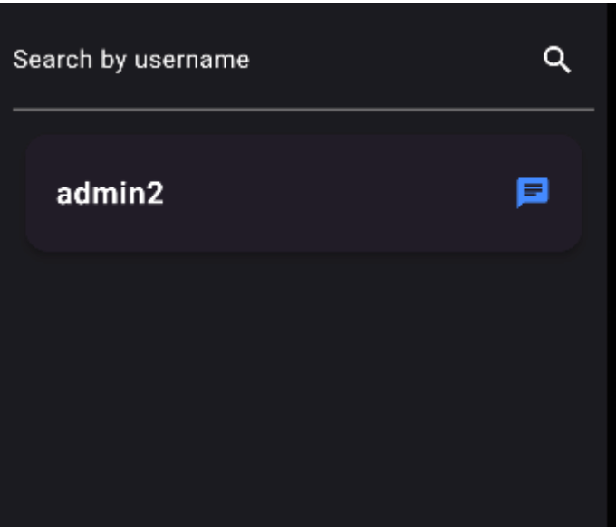
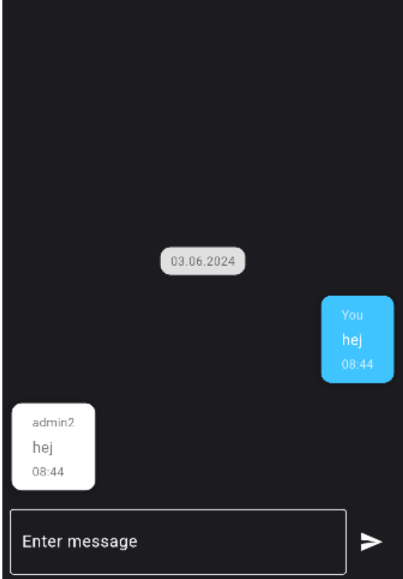
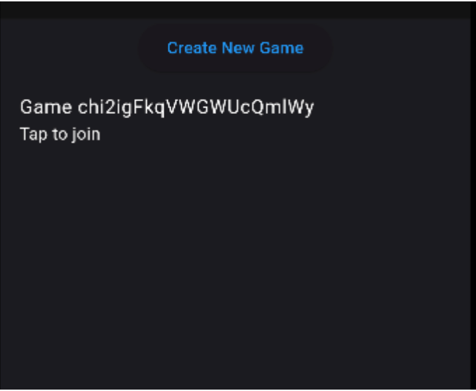
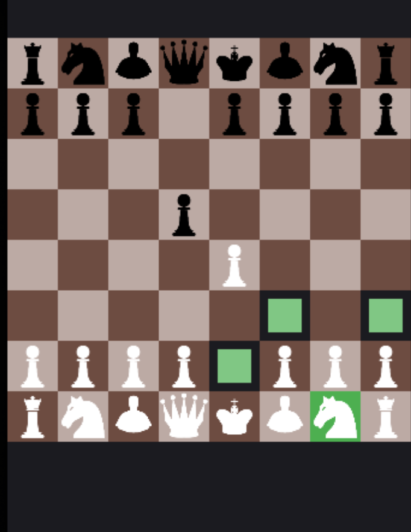

# ♟ Chess Community App – A Social App for Chess Enthusiasts

A social mobile app centered around the world of chess. It allows users to interact with each other, create personal profiles, comment on posts, add friends, and play online chess games with friends.

---

## 📌 Functional Features

- Play online chess matches  
- Create game lobbies  
- Join existing lobbies  
- Add posts in the community section  
- Comment on other users' posts  
- React to posts  
- Register a new account  
- Create and edit your profile biography  
- Add other users as friends  
- Send messages to friends  
- View profiles of your friends  

---

## 🛠 Technologies and Tools Used

- **Flutter (Dart)** – Main development framework, chosen for its cross-platform capabilities  
- **Firebase** – Used for backend services: database and user authentication  
- **Visual Studio Code** – Main code editor used for the project  
- **GitHub** – Source code version control and remote repository  
---

## 👤 Responsibilities – Oscar Czempiel

- Firebase database integration  
- Improving registration and login panels  
- Implementing the **Community** panel  
- Implementing the **Friends** panel  
- Enhancing the **Profile** section  
- Adding post comments  
- Implementing the chat feature between friends  
- Enabling friend management features  

---

## 🖼️ Screenshots

🔐 Login Panel  


📝 Registration Panel  


🏠 Main Menu  


👥 Community Panel  


🙍‍♂️ Profile Panel  


🧑‍🤝‍🧑 Friends Panel  


💬 Chat with Friends  


🎮 Game Lobby  


♟️ Chess Game Screen  


---

## 🚀 How to Run the Project

```bash
flutter pub get
flutter run
